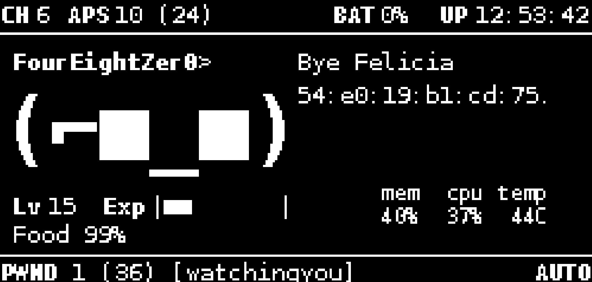
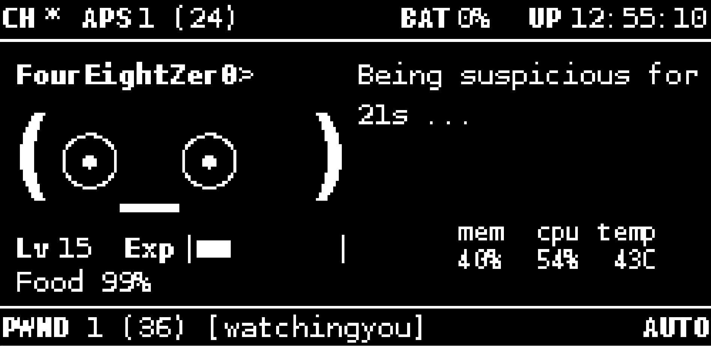

This plugin is designed to work with jayofelony Pwnagotchi 2.9.5.4

# Nomagotchi

A Pwnagotchi plugin that Allows you to easily customize your Pwnagotchi's phrases

## Install

1. Copy `trashtalk.py` to your Pwnagotchi custom plugins directory:

   - Typical path: `/usr/local/share/pwnagotchi/custom-plugins/trashtalk.py`

2. Add the following to your `config.toml`:

```toml
[main.plugins.trashtalk]
enabled = true

[main.plugins.trashtalk.phrases]
on_starting = ["Systems nominal.", "Boot sequence complete.", "Ready for trouble."]
on_assoc = ["Yo {what}, let me in.", "Oh hi there {what}.", "Knocking on {what}."]
on_deauth = ["Bye Felicia {mac}.", "Thats enough WIFI for you {mac}.", "Oops, BYE {mac}."]
on_handshakes = ["Got emmm! Captured {num} handshake{plural}.", "I'll be taking that thanks...", "Yoink. {num} handshake{plural} acquired."]
on_waiting = ["Time for a nap. {secs}s...", "Being suspicious for {secs}s ..."]
on_uploading = ["Sending loot to {to} ...", "Uploading goodies to {to} ..."]
```

3. Restart Pwnagotchi.

4. Check out my other plugins
- Pwnagotchi-Nomagotchi-Food-Plugin
- Pwnagotchi-TrashTalk-Custom-Phrases-Plugin
- Pwnagotchi-EXPv3-Plugin
- Pwnagotchi-WebSSH-Plugin
https://github.com/FourEightZer0